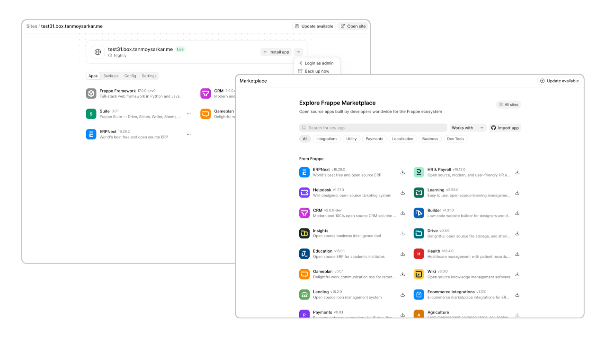

<p align="center">
  
</p>

<h1 align="center">Pilot</h1>

<p align="center">
  <strong>Manage Frappe benches and sites on any server</strong>
</p>

<p align="center">
  = 3.11">
  <a href="https://github.com/frappe/pilot/actions/workflows/unit-tests.yml">
    
  </a>
  
</p>

Pilot makes it simple to run Frappe on your own servers. Use the Admin UI to manage apps, sites, processes, backups, domains, and production setup, with a CLI for automation.



## Key Features

- Bench and site lifecycle: create, update, rename, restore, back up, and drop
- Integrated marketplace to install apps on sites from Git repositories or the app registry
- Local development runner for Redis, web, workers, socket.io, and Admin UI
- Production setup for process managers, nginx, monitoring, domains, and TLS
- Devtools for investigation: SQL playground, database analyzer, binlog browser, logs, and task history

## Requirements

- Debian 12+, Ubuntu 22.04+, Fedora 40+, Arch Linux, or macOS with Homebrew for local development
- Python 3.11+

## Installation

Run the installer as your normal user:

```bash
curl -fsSL https://raw.githubusercontent.com/frappe/pilot/main/install.sh | bash
```

On a root-only VPS, run it as root; the installer creates a non-root bench user.

## Basic Usage

Create a bench and launch the setup wizard:

```bash
bench new main
bench -b main start
```

The first `start` opens the Admin setup wizard at `http://localhost:8002`. The wizard asks for the Admin password, database settings, and Frappe source settings, then initializes the bench with live task progress.

Manual setup:

```bash
bench new main
$EDITOR benches/main/bench.toml
bench -b main init
bench -b main get-app https://github.com/frappe/erpnext --branch version-16
bench -b main new-site site1.localhost
bench -b main start
```

After start:

- Site: `http://site1.localhost:8000`
- Admin UI: `http://localhost:8002`

Common commands:

| Command | Purpose |
|---|---|
| `bench new <name>` | Create a bench and `bench.toml` |
| `bench ls` | List benches, status, production state, and Admin URL |
| `bench -b <name> init` | Initialize a bench from `bench.toml` |
| `bench -b <name> start` | Start development processes |
| `bench -b <name> stop` | Stop development processes |
| `bench -b <name> get-app <repo>` | Clone and install an app |
| `bench -b <name> new-site <site>` | Create a site |
| `bench -b <name> update` | Pull apps, install deps, build assets, and migrate sites |
| `bench -b <name> setup production` | Configure process manager, nginx, Admin domain, and optional TLS |
| `bench -b <name> restart` | Restart production processes |
| `bench -b <name> remove production` | Remove production deployment files and services |

For the full command list, see [Commands](docs/commands.md).

## Configuration

Each bench has one `bench.toml`. It is the source of truth for apps, database, Redis, workers, production, nginx, gunicorn, Let's Encrypt, Admin, firewall, WAF, S3, and monitoring settings.

Minimal shape:

```toml
[bench]
name = "main"
python = "3.11"

[[apps]]
name = "frappe"
repo = "https://github.com/frappe/frappe"
branch = "version-16"

[mariadb]
host = "localhost"
port = 3306
root_password = "your-root-password"

[redis]
cache_port = 13000
queue_port = 11000

[[workers]]
queues = ["default", "short", "long"]
count = 1

[admin]
port = 8002
password = "your-admin-password"
domain = ""
tls = false
```

Apps and sites also exist on disk under the bench. See [Configuration](docs/configuration.md) for every config section.

## Production

Production setup writes process-manager config, nginx integration, Admin routing, monitoring config, and optional Let's Encrypt certificates.

```bash
bench -b main setup production --admin-domain admin.example.com
bench -b main setup production --admin-domain admin.example.com --tls --letsencrypt-email ops@example.com
```

The Admin domain is required in production. Set `admin.tls = false` when HTTPS terminates at an upstream proxy.

Supported process managers:

- `systemd`
- `supervisor`
- `none` for local development

See [Production](docs/production.md).

## Admin UI

The Admin UI runs on `[admin] port`, usually `8002`. It exposes bench status, apps, marketplace installs, sites, backups, domains, processes, logs, tasks, database tools, updates, and settings.

Long-running Admin operations return task IDs. Task progress, logs, callbacks, and final status are handled by `pilot.tasks`.

See [Admin UI](docs/admin-ui.md) and [Admin API](docs/admin-api.md).

## Guides

- [Architecture](docs/architecture.md)
- [Commands](docs/commands.md)
- [Configuration](docs/configuration.md)
- [Tasks](docs/tasks.md)
- [Admin API](docs/admin-api.md)
- [Admin UI](docs/admin-ui.md)
- [Production](docs/production.md)
- [Domain Provider](docs/domain-provider.md)

## Development

<details>
<summary>Development setup and checks</summary>

Use a source checkout when working on Pilot:

```bash
git clone https://github.com/frappe/pilot ~/pilot
cd ~/pilot
export PATH="$PWD:$PATH"
```

Create a development bench:

```bash
bench new dev
bench -b dev start
```

Useful development toggles in `bench.toml`:

```toml
[bench]
watch_apps_js = true
reload_python = true
watch_admin_js = true
```

Run checks:

```bash
uv run ruff check admin pilot tests
uv run pytest tests/ --ignore=tests/integration
```

Integration tests under `tests/integration/` use real services and run the full bench lifecycle.

</details>

## Community

- [Frappe Forum](https://discuss.frappe.io/)
- [Frappe Framework Docs](https://frappeframework.com/docs)
- [Frappe YouTube](https://www.youtube.com/@frappetech)

## Contributing

Keep CLI commands and Admin API routes thin. Put behavior on the closest core object: `Server`, `Bench`, `Site`, `App`, or a task.

Read [SPEC.md](SPEC.md), [Architecture](docs/architecture.md), and [Commands](docs/commands.md) before changing behavior.

## Security

The Frappe team and community prioritize security. If you discover a security issue, please report it via our [Security Report Form](https://frappe.io/security).
Your responsible disclosure helps keep Frappe and its users safe. We'll do our best to respond quickly and keep you informed throughout the process.
For guidelines on reporting, check out our [Reporting Guidelines](https://frappe.io/security), and review our [Logo and Trademark Policy](https://github.com/frappe/erpnext/blob/develop/TRADEMARK_POLICY.md) for branding information.

<br/><br/>

<div align="center">
	<a href="https://frappe.io" target="_blank">
		<picture>
			<source media="(prefers-color-scheme: dark)" srcset="https://frappe.io/files/Frappe-white.png">
			
		</picture>
	</a>
</div>
